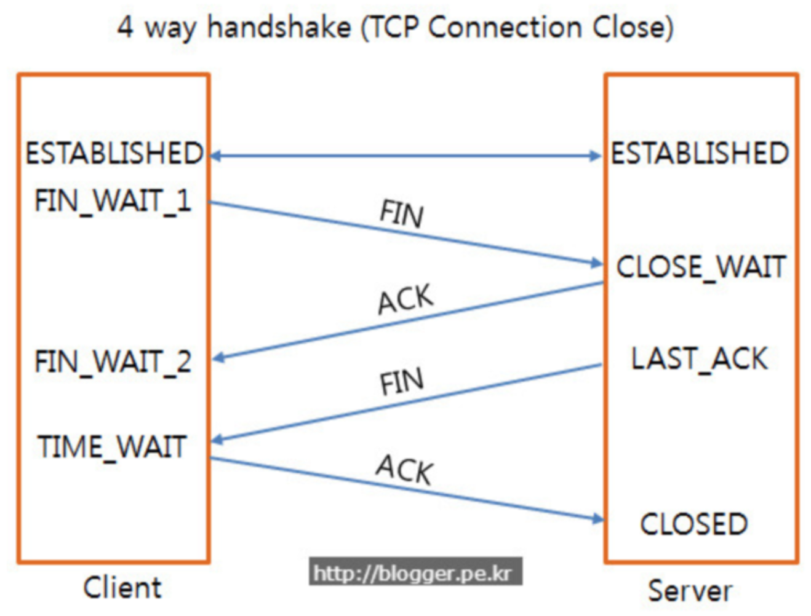

### TCP연결의 시작 3-way-handshake 

1. 클라이언트가 conncet()함수를 호출할 때 연결 요청(SYN)을 보내고, 
2. 서버는 연결 요청에 대한 확인과 응답(SYN,ACK)을 보낸다. 
3. 클라이언트는 응답(ACK)을 하고 그 때 연결이 성립(establish)된다.  

### TCP연결의 끝 4-way-handshake

1. 클라이언트는 closesocket() 함수를 호출하고 서버에게 TCP패킷에 FIN 플래그를 넣은 해제 요청(FIN)을 보낸다. 요청을 보내면 클라이언트는 FIN_WAIT_1 상태에 들어간다. 
2. FIN요청을 받은 서버는 클라이언트에게 해제에 대한 응답(ACK)를 보내고 CLOSE_WAIT 상태에 들어간다. 클라이언트는 ACK 세그먼트를 받고 FIN_WAIT_1 상태에서 FIN_WAIT_2 상태로 이동한다. 
**1-2 과정은 클라이언트가 능동적 종료를 위해 closesocket 함수를 호출하면서 진행된 부분이다.**
3. 이제 서버가 수동적 종료(능동은 먼저하는거 수동은 후에 하는거 정도로 생각하자)를 위해 CLOSE_WAIT 상태에서 closesocket()를 호출한다. 이 함수를 호출하면 서버는 FIN 세그먼트를 클라이언트에게 보내고 서버는 LAST_ACK 상태로 이동한다.
4. FIN_WAIT_2상태까지 이동한 클라이언트는 서버가 보낸 FIN세그먼트를 받고 ACK를 전송한 후 TIME_WAIT 상태로 이동한다. 
5. 서버는 LAST_ACK 상태에서 클라이언트가 보낸 ACK세그먼트를 받고 소켓 객체를 완전히 닫는다. 
**클라이언트의 TIME_WAIT 상태는 2MSL(Max Segment Life, 윈도우즈 운영체제는 4분 리눅스는 2분) 이후에 닫히게 된다.**

위의 과정이 **Gracefully shutdown** 이다.  
>Gracefully shutdown 이란?  
우아한 종료는 클라이언트가 능동적으로 먼저 종료를 요청하고 서버는 종료 요청을 받은 뒤 종료하여 끝나는 것이다. 이 말은 즉, 클라이언트가 시간적으로 먼저 closesocket() 함수를 호출하여 서버에게 FIN 요청을 보내서 접속 해제를 하는 것이다.

왜 **Gracefully shutdown**이 필요할까?

이유는 간단하다. 클라이언트가 먼저 종료를 하는지, 서버가 먼저 종료를 하는지에 따라 소켓이 닫히는 동작과 시점이 달라지게 되고 서버는 절대로 "TIME_WAIT"상태에 가면 안되기 때문이다.  
**클라이언트의 TIME_WAIT 상태는 정상이지만 서버의 TIME_WAIT 상태는 에러이다.**

아까 클라이언트는 마지막 ACK를 보내고 아무런 응답을 받지 못한다. (당연히 맨 마지막 응답이니까) 그렇기 때문에 2MSL 시간 동안 TIME_WAIT 상태로 대기하면서 서버가 아무런 재전송을 요구하지 않으면 마지막 ACK를 정상적으로 수신했다고 생각하고 클라이언트의 소켓 객체는 닫게 된다.  
2MSL시간 동안 기다리는 도중에 서버가 FIN세그먼트를 보내면 마지막 ACK 세그먼트를 못 받은 것으로 간주하고 클라이언트는 ACK세그먼트를 재전송한다.  
이전 세그먼트들은 에러가 발생한 경우 다시 오는 세그먼트를 통해 에러를 보정할 방법이 있지만 마지막 ACK 세그먼트는 이러한 방법이 없기 때문에 TIME_WAIT상태가 필요한 것이다. 그러므로 **클라이언트에게 생기는 TIME_WAIT상태는 안전하게 전송함을 보장했음을 알기 위한 정상적인 상태이다.**  
(TIME_WAIT의 2MSL 시간 동안 클라이언트의 소켓 객체는 닫히지 못하고 있지만 클라이언트의 소켓 객체는 하나이기 때문에 시스템 전체에 문제가 되지 않는다.)  

하지만 서버가 능동적인 종료를 한다면 TIME_WAIT 상태가 서버에게 발생한다. 이것은 큰 논리적인 에러이다.  
서버에서 먼저 종료를 하면 서버 역시 TIME_WAIT 상태로 2MSL 시간 동안 대기하게 되고 이 시간 동안은 소켓 객체가 사라지지 않게 된다. 클라이언트와 달리 서버는 여러 클라이언트와 교신을 하고 엄청난 횟수로 소켓을 생성했다 닫았다를 반복한다. 이 때 서버가 능동적 종료를 하여 **TIME_WAIT 상태를 가져서 대기하게 된다면 서버 소켓 자원은 금새 고갈되고 만다.**  

이러한 이유로 클라이언트에 TIME_WAIT 상태를 만들기 위해 클라이언트가 먼저 종료를 해야하고, 이는 코드상에서 클라이언트가 먼저 종료를 할 수 있게 유도할 수 있다.  
클라이언트가 마지막으로 서버에 어떤 값이든 write()를 하여 먼저 종료하고, 서버는 무조건 read를 하고 나서 종료하면 시간적으로 클라이언트가 먼저 종료하게 만들 수 있다.  

클라이언트의 TIME_WAIT 상태는 지극히 정상적이지만 그냥 TIME_WAIT 자체가 싫다면,  
소켓의 옵션을 설정하는 setsockopt() 함수로 closesocket() 함수가 호출되면 대기없이 바로 폐기되도록 설정할 수 있다. 만약 서버에 어쩔 수 없이 TIME_WAIT 상태를 만들었다면 TIME_WAIT 상태에 있는 소켓 자원을 재활용 할 수 있게 SO_REUSEADDR 옵션을 설정하면 된다.   
